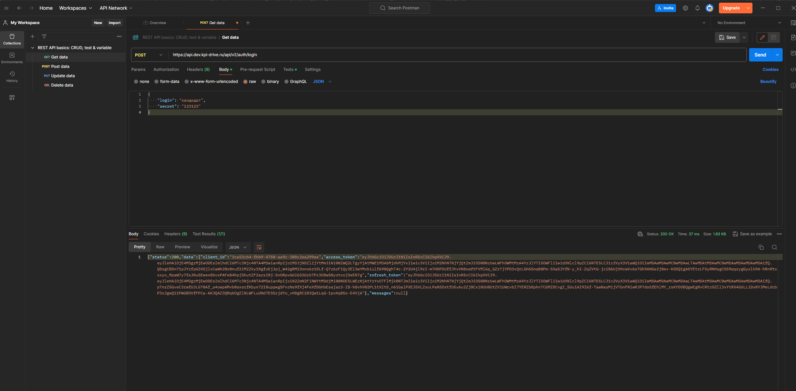
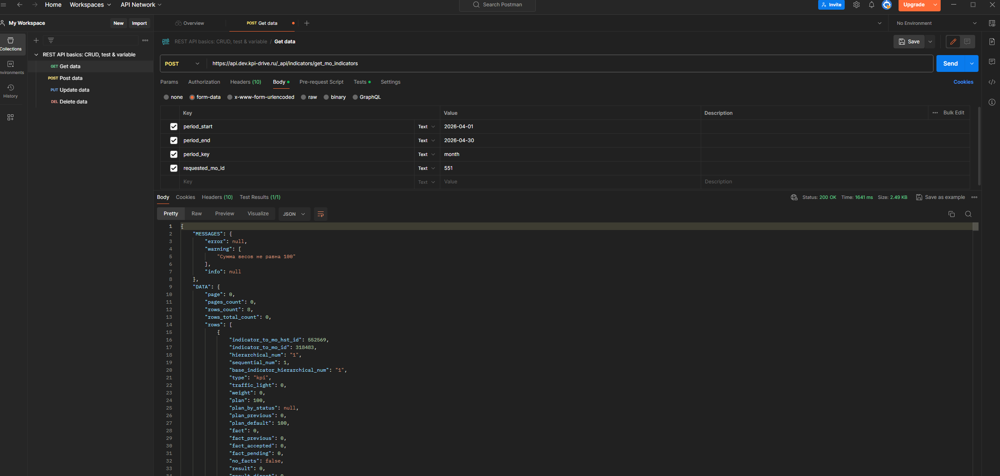
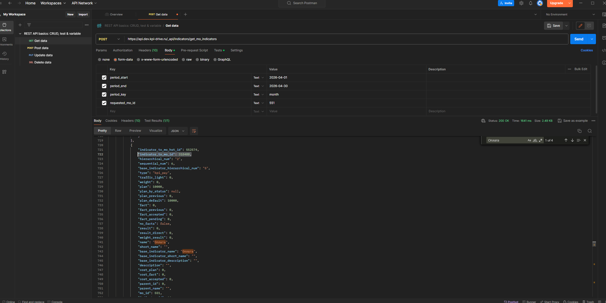
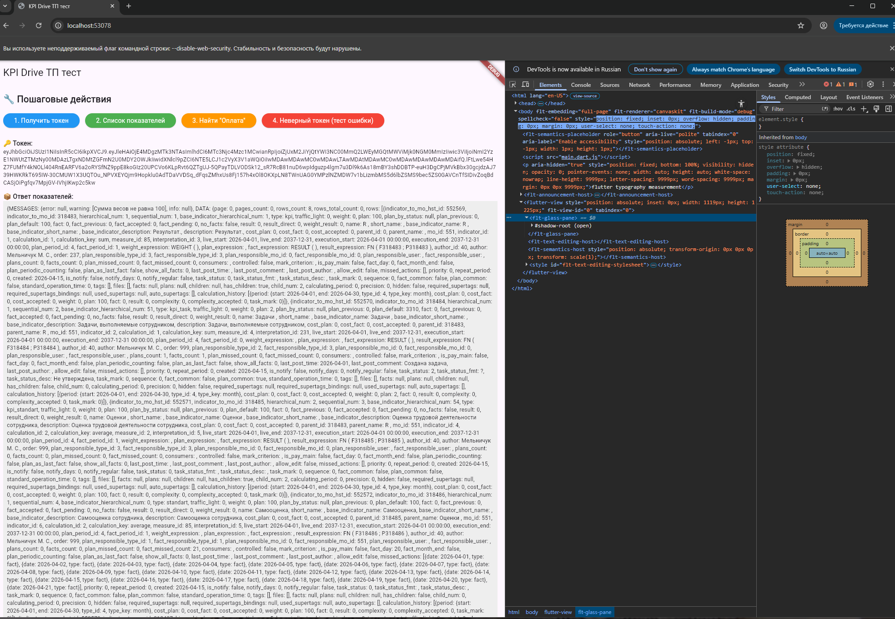
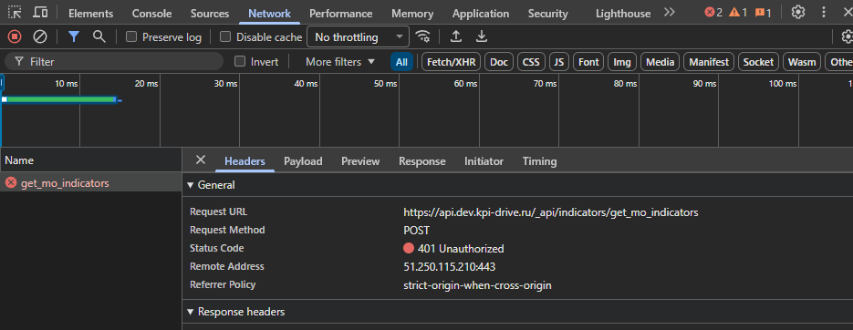

# KPI Drive ТП — тестовое задание

Flutter-приложение для демонстрации работы с API KPI Drive.

## Что делает приложение

- Авторизуется и получает `access_token`
- Запрашивает список показателей за апрель 2026
- Находит показатель «Оплата» и выводит `indicator_to_mo_id`
- Показывает результат запроса с неверным токеном (401 Unauthorized)

## Как запустить

1. Установите Flutter
2. Склонируйте репозиторий
3. Выполните `flutter pub get`
4. Запустите `flutter run`

## Скриншоты Postman

(добавьте сюда свои скриншоты, сделанные в Postman)

## Ответ на вопрос

**Что будет при неверном/просроченном токене?**  
HTTP-статус: `401 Unauthorized`  
Тело ошибки: `{"message": "Unauthorized"}` (или аналогичное)

## Скриншоты

### 1. Получение токена в Postman

### 2. Список показателей

### 3. Показатель индикатора в оплате

### 4. Скриншот приложения

### 5. Скриншот ошибки авторизации (из браузера)

